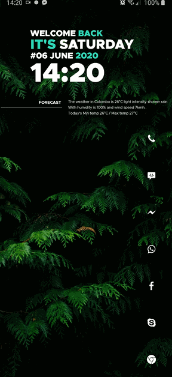
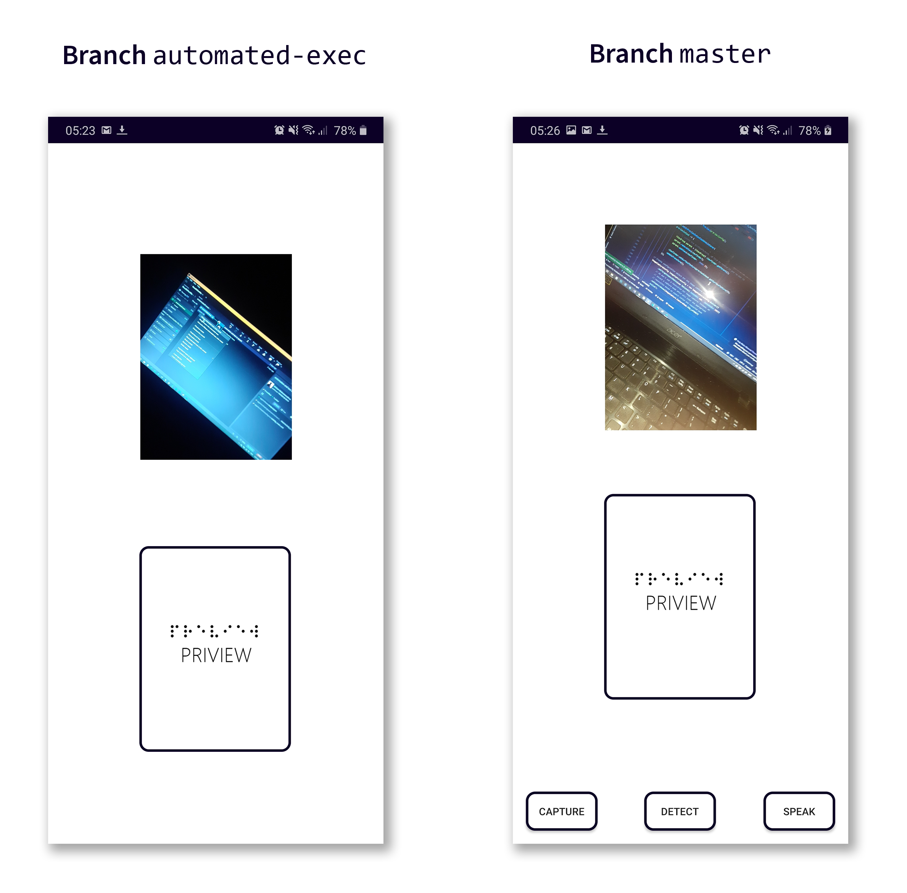

ReadItForMe
# Recognize Text in Images with Firebase ML on Android with Text-to-Speech.

### Follow directions on [here](https://firebase.google.com/docs/android/setup), download and replace `google-services.json` in this project.

Use branch `master` for UI controls and branch `automated-exec` for automated UI.

